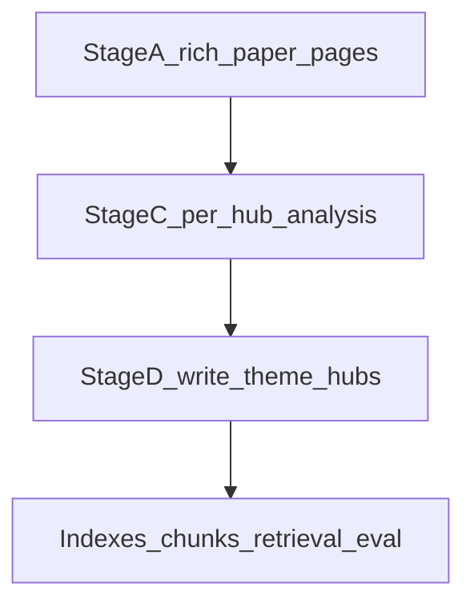

# Master plan — operator roadmap (post Phase 4 first pass)

This file is the **single canonical roadmap** after paper-level curation is complete. It ties together [`PHASE0.md`](PHASE0.md) KPIs, [`PHASE4_RUNBOOK.md`](PHASE4_RUNBOOK.md) (including **Wave 2** connectivity), [`PHASE5_RUNBOOK.md`](PHASE5_RUNBOOK.md) (retrieval), and optional [`PHASE8_EXPORT.md`](PHASE8_EXPORT.md) (public export—policy only).

## What is already done

- **Phase 4 first pass:** Every `wiki/papers/{slug}.md` has curated prose (no mechanical stub phrase / pending tag), `paper_keywords`, Methods/Findings, and machine indexes regenerated as needed. See [`outputs/curation_batches/`](../outputs/curation_batches/) approvals.
- **Chunk pipeline:** [`scripts/build_chunks.py`](../scripts/build_chunks.py) can rebuild [`indexes/chunks.jsonl`](../indexes/chunks.jsonl) from `wiki/`.
- **Synthesis-layer pass (themes + entry points + debates + protocols):** blueprint and execution completed with grounded website prose and MAS routing hooks. See [`outputs/SYNTHESIS_LAYER_BLUEPRINTS.md`](../outputs/SYNTHESIS_LAYER_BLUEPRINTS.md) and [`outputs/SYNTHESIS_LAYER_COMPLETION.md`](../outputs/SYNTHESIS_LAYER_COMPLETION.md).
- **Paper-to-theme assignment gate:** deterministic coverage report now tracks that each `paper:` slug maps to at least one theme (`0` unassigned). See [`outputs/paper_theme_coverage.md`](../outputs/paper_theme_coverage.md) and [`outputs/paper_theme_assignments.json`](../outputs/paper_theme_assignments.json).

## Phase: rich papers + analysis-driven theme hubs

This phase runs **after** the first-pass wiki exists and **deepens** evidence-grounded pages before (and while) expanding theme hubs. **Order:** paper layer richness → per-hub pre-writing analysis → hub prose → indexes/chunks/MkDocs (optional retrieval eval). It does **not** replace the connectivity/retrieval loop below; it **feeds** it with denser paper notes and better-structured synthesis pages.

| Stage | Work | Pointers |
|-------|------|----------|
| **A** | Standalone paper pages meet agreed **richness** (sections + word threshold); batches until backlog clears | [`scripts/report_paper_richness.py`](../scripts/report_paper_richness.py) → [`outputs/paper_richness_backlog.md`](../outputs/paper_richness_backlog.md); operator note [`outputs/STAGE_A_PAPER_ENRICHMENT.md`](../outputs/STAGE_A_PAPER_ENRICHMENT.md); exceptions [`docs/corpus/NON_PRIMARY_ARTICLE_PAPER_SLUGS.md`](corpus/NON_PRIMARY_ARTICLE_PAPER_SLUGS.md) |
| **B** | Hub section template (analysis, corpus gaps, reactive-MD vs ReaxFF disambiguation) | [`AGENTS.md`](../AGENTS.md) *Theme hub pages* |
| **C** | Per-hub **pre-writing** analysis (inventory, sub-themes, section map, draft `source_refs`, KB gaps) | [`outputs/theme_plans/`](../outputs/theme_plans/) |
| **D** | New/expanded `wiki/concepts/theme-*.md` and cross-links | [`wiki/concepts/themes-index.md`](../wiki/concepts/themes-index.md) |
| **Close** | Regenerate paper indexes, chunks; optional [`scripts/eval_retrieval.py`](../scripts/eval_retrieval.py); `mkdocs build --strict` | [`PHASE5_RUNBOOK.md`](PHASE5_RUNBOOK.md) |

## Iterative loop (connectivity + retrieval)

Do **not** wait for perfect theme coverage before the first retrieval baseline. Measure, enrich the graph, measure again.

1. **Mechanical connectivity audit** — [`scripts/report_paper_connectivity.py`](../scripts/report_paper_connectivity.py) writes [`outputs/connectivity_report.md`](../outputs/connectivity_report.md): which paper slugs appear linked from synthesis trees (`wiki/concepts/`, `materials/`, `forcefields/`, `protocols/`, optional `debates/`). Use the orphan list as Wave 2 backlog.
2. **Phase 5 baseline** — Build BM25 + vectors, run [`scripts/eval_retrieval.py`](../scripts/eval_retrieval.py), archive [`outputs/phase5_retrieval_report.md`](../outputs/phase5_retrieval_report.md). Establishes a number line for later tuning.
3. **Phase 4 Wave 2** — LLM-led: expand [`wiki/concepts/theme-*.md`](../wiki/concepts/) “Literature review (this knowledge base)” sections, add wikilinks from hubs to papers, close orphans until [`PHASE0.md`](PHASE0.md) connectivity target is approached. **Debates** and **corpus-scoped survey** prose belong here (see [`AGENTS.md`](../AGENTS.md)), **not** in Phase 8.
4. **Phase 5 iteration** — `build_chunks.py` → `build_bm25.py` → `build_vectors.py` → `eval_retrieval.py` again. Tune `top_k`, RRF weights, or switch to `sentence_transformers` per [`requirements-phase5.txt`](../requirements-phase5.txt) if baseline recall is weak.
5. **Site check** — After large wiki edits: `python3 scripts/generate_papers_indexes.py`, `mkdocs build --strict`.

## Benchmarks

- Frozen eval set: [`benchmarks/v1_frozen.yaml`](../benchmarks/v1_frozen.yaml), [`benchmarks/V1_FROZEN.md`](../benchmarks/V1_FROZEN.md).
- Warm-up pool: [`benchmarks/WARMUP_CANDIDATE_QUESTIONS.md`](../benchmarks/WARMUP_CANDIDATE_QUESTIONS.md). Refresh after major ingests ([`PHASE0.md`](PHASE0.md)).

## Phase naming (clarification)

| Phase | Scope |
|-------|--------|
| **Phase 4 Wave 2** | Theme hubs, cross-links, debates, corpus-scoped synthesis pages — **LLM-led**, evidence-grounded. |
| **Phase 5** | Hybrid retrieval under `indexes/` — **mechanical** indexing + benchmark grading. |
| **Phase 8** | **Public/export** subset, redaction, rights — see [`PHASE8_EXPORT.md`](PHASE8_EXPORT.md). Not “more wiki content.” |

## Explicitly later / gated

- **Finetuning or synthetic Q&A corpora** for model weights: only after retrieval is stable, with a clear **license and privacy** review for text derived from PDFs.
- **`paper_curation_batches.py` without `--dry-run`** overwrites `outputs/curation_batches/manifest.json` (drops custom `approvals`). Prefer `--dry-run` or back up the manifest before regenerating batch files.

## Related files

- KPIs: [`PHASE0.md`](PHASE0.md)
- Wave 2 detail: [`PHASE4_RUNBOOK.md`](PHASE4_RUNBOOK.md) (Post-first-pass section)
- Retrieval commands: [`PHASE5_RUNBOOK.md`](PHASE5_RUNBOOK.md), [`indexes/README.md`](../indexes/README.md)
- Session bootstrap: [`SESSION_PRIMER.md`](SESSION_PRIMER.md)
- Operations handbook: [`KB_OPERATIONS_MANUAL.md`](KB_OPERATIONS_MANUAL.md)
- Gap log: [`outputs/phase4_gaps.md`](../outputs/phase4_gaps.md)
- Connectivity status: [`outputs/wave2_connectivity_status.md`](../outputs/wave2_connectivity_status.md), [`outputs/connectivity_report.md`](../outputs/connectivity_report.md)
- Phase 5 reports: [`outputs/phase5_retrieval_report.md`](../outputs/phase5_retrieval_report.md), [`outputs/phase5_iteration_notes.md`](../outputs/phase5_iteration_notes.md)
